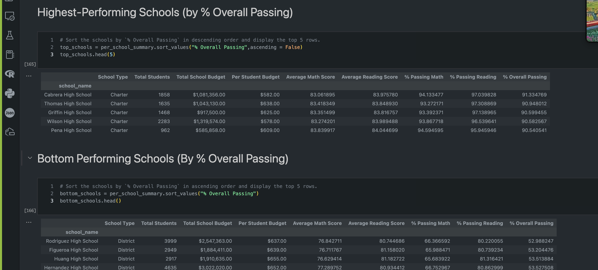

# Pandas Analysis

## Description
Manipulate Pandas DataFrames to analyze school and standardized test data.

## Table of Contents
- [Installation](#installation)
- [Usage](#usage)
- [Credits](#credits)
- [License](#license)
- [Features](#features)

- [Contact](#contact)

## Installation
Pandas and Python, Jupyter Notebook

## Usage
Run the Jupyter Notebook to get the summary information.

## Credits
Catherine Matthews

## License
MIT

## Features
It provides summary data

## Contact
If there are any questions of concerns, I can be reached at:
##### [github: mattcat1221](https://github.com/mattcat1221)
##### [email: caseyvmatthews@gmail.com](mailto:caseyvmatthews@gmail.com)
